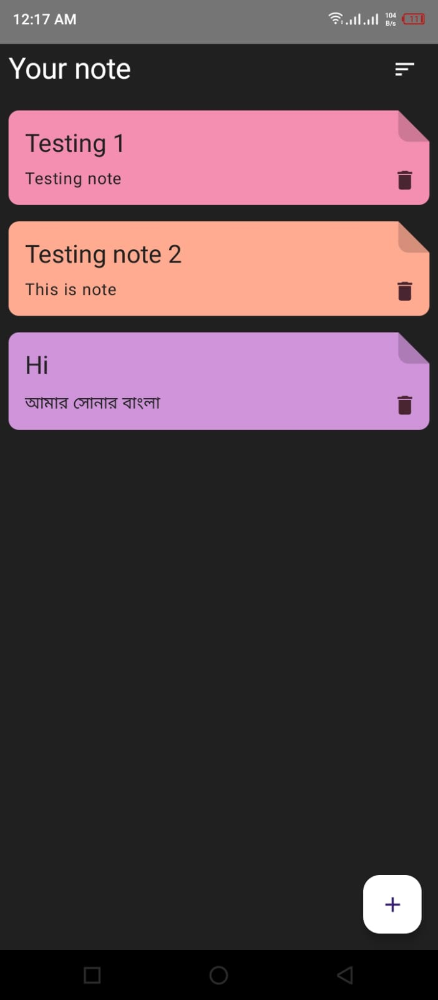
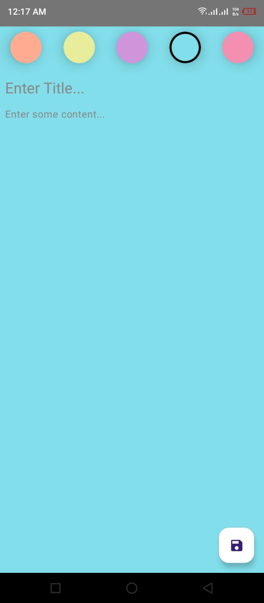
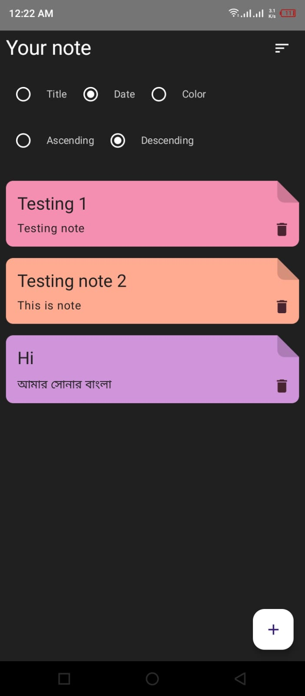

# Android-Projects
---

# 📓 Note App

A clean and minimal Android application to take notes.

## ✨ Features

- ✍️ Create, edit, and delete notes
<!--
- 🖼️ Add images to your notes
- 🎨 Apply basic text styling (bold, italic, underline) -->
- 🔍 Search notes
- 📦 Local storage using Room Database
- 🧱 MVVM Architecture with Repository pattern

## 🛠️ Built With

- **Kotlin**
- **Jetpack Compose**
- **Room Database**
- **ViewModel & LiveData**
- **Hilt (Dependency Injection)**
- **Coil (for Image Loading)**

## 📸 Screenshots

  

## 📥 Download APK

🔗 [Download APK](https://drive.google.com/file/d/your_apk_file_id/view?usp=sharing)

<!--
## 🎥 Video Demo

▶️ [Watch Demo](https://drive.google.com/file/d/your_demo_video_id/view?usp=sharing)

## 📁 Project Structure-->

---

# 📱 Expense Tracker App

A simple and beautiful Android app to track your daily expenses, income, and view summaries in chart format.

## 🚀 Features
- Add, edit, delete expenses and income entries
- Group data by day/week/month
- Visual representation using GraphView
- Local storage with Room Database
- MVVM architecture with Repository pattern

## 🛠️ Technologies Used
- Kotlin
- Jetpack Compose
- Room Database
- ViewModel & LiveData
- Material Design Components

## 📸 Screenshots
 

## 📦 Download APK
🔗 [Download APK](https://drive.google.com/file/d/your_apk_file_link/view?usp=sharing)

## 🌐 Live Demo (if any)
[👉 Watch Video Demo](https://drive.google.com/file/d/your_video_link/view)

## 📁 Project Structure
