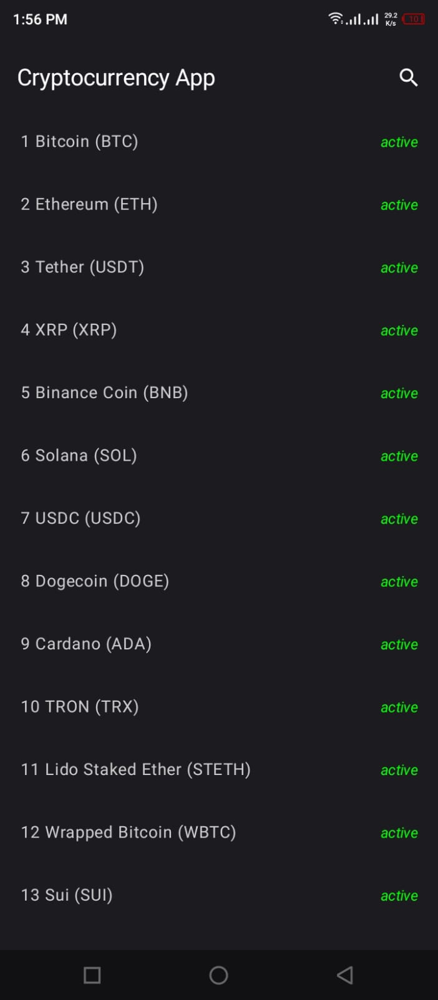
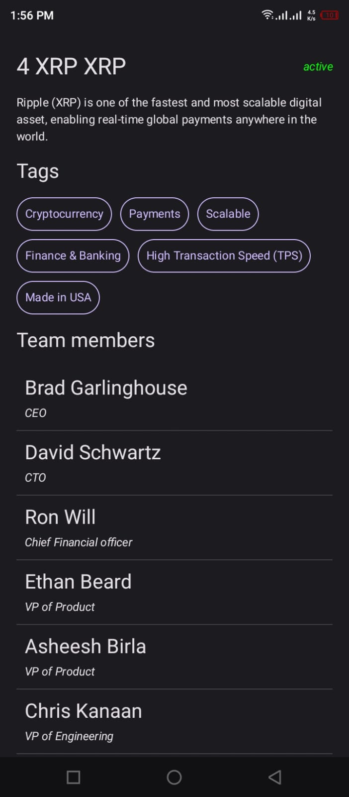
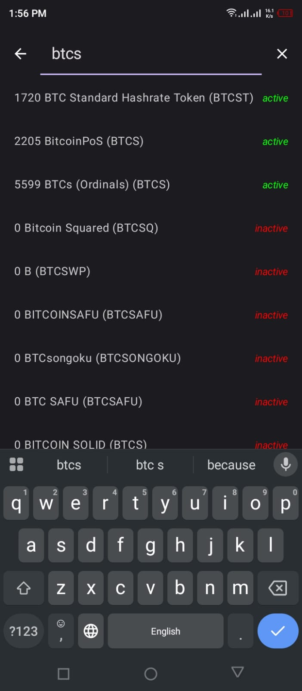
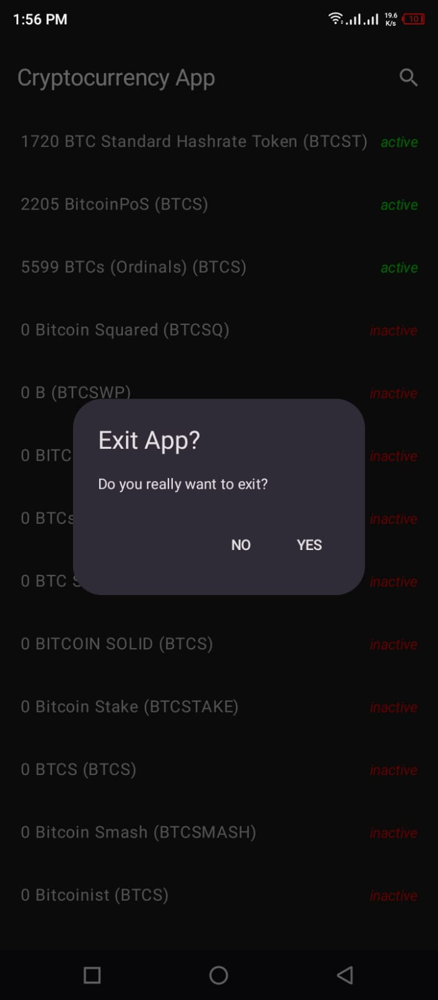

# Android-Projects
---

# 📓 Note App

A clean and minimal Android application to take notes.

## ✨ Features

- ✍️ Create, edit, and delete notes
<!--
- 🖼️ Add images to your notes
- 🎨 Apply basic text styling (bold, italic, underline) -->
- 🔍 Sort notes
- 📦 Local storage using Room Database
- 🧱 MVVM Architecture with Repository pattern

## 🛠️ Built With

- **Kotlin**
- **Jetpack Compose**
- **Room Database**
- **ViewModel & LiveData**
- **Hilt (Dependency Injection)**
<!--
- **Coil (for Image Loading)** -->

## 📸 Screenshots

  

## 📥 Download APK

🔗 

## 📂 View Source Code

🔗 [GitHub Repository](https://github.com/abdullahalnuman0/Notepad-App-Jetpack-Compose)

---
---
---

# 💰 Cryptocurrency Info App

An Android app to explore and learn about various cryptocurrencies like **Bitcoin (BTC), Ethereum (ETH), Tether (USDT)**, and many more.

The app provides detailed information about each coin, including its creators, description, launch year, tags, and current market stats.

## ✨ Features

- 📋 List of 10000+ cryptocurrencies
- 🔎 Search and filter by coin name or tag
- 🧠 View creator details and launch year
- 🧾 Full coin description and purpose
- 🏷️ Tags like "Store of Value", "DeFi", "Stablecoin" <!-- - 🌙 Light & Dark Theme support -->
- 🌙 Dark Theme support
- 📡 Fetch live data from public API

## 🛠️ Built With

- **Kotlin**
- **Jetpack Compose**
- **Retrofit (API calls)** <!-- - **Coil (Image loading)** -->
- **Hilt (Dependency Injection)**
- **MVVM Architecture**

## 📸 Screenshots

   

## 📥 Download APK

🔗 

🔗 [GitHub Repository](https://github.com/abdullahalnuman0/Cryptocurrency-Info-App)

---
---
---
# Weather-App-Jetpack-Compose
# ☁️ Weather App

Welcome to **Weather App**, a sleek and modern weather forecasting application built entirely using **Jetpack Compose**. Stay updated with real-time weather data in both **dark** and **light** modes for a seamless user experience.

## 🔎 About This App
- **Real-Time Weather Updates**: Get the latest weather forecasts with accurate data.
- **Jetpack Compose UI**: Fully designed with Jetpack Compose for a smooth and responsive user interface.
- **Dark & Light Modes**: Switch effortlessly between dark and light themes.
<!-- - **Location-Based Forecast**: Automatically fetch weather details based on your current location. -->
- **Minimal & Clean Design**: Focused on providing an intuitive user experience with minimal distractions.

## 🖼️ App Screenshots

### Dark Mode

### Light Mode

## 📥 Download the App

Click the button below to download the latest version of **Weather App**:

🔗 [GitHub Repository](https://github.com/abdullahalnuman0/Weather-App-Jetpack-Compose)

--- 
----
-----

The rest will come soon.(date: May 07, 2025)

E-commerce
Blog App
Smart Contact Manager App
Real-time chat App
Video streaming App
Weather Ap
Expense Tracker
TicTacToe (Game)
To Do List
Note App
QR/Barcode scanner and generator App
Arduino controller App

<!--
## 🎥 Video Demo

▶️ [Watch Demo](https://drive.google.com/file/d/your_demo_video_id/view?usp=sharing)

## 📁 Project Structure-->

---
<!--
# 📱 Expense Tracker App

A simple and beautiful Android app to track your daily expenses, income, and view summaries in chart format.

## 🚀 Features
- Add, edit, delete expenses and income entries
- Group data by day/week/month
- Visual representation using GraphView
- Local storage with Room Database
- MVVM architecture with Repository pattern

## 🛠️ Technologies Used
- Kotlin
- Jetpack Compose
- Room Database
- ViewModel & LiveData
- Material Design Components

## 📸 Screenshots
 

## 📦 Download APK
🔗 [Download APK](https://drive.google.com/file/d/your_apk_file_link/view?usp=sharing)

## 🌐 Live Demo (if any)
[👉 Watch Video Demo](https://drive.google.com/file/d/your_video_link/view)

## 📁 Project Structure

-->
